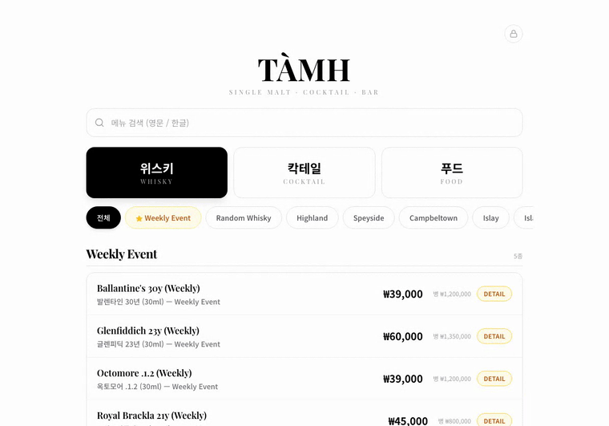
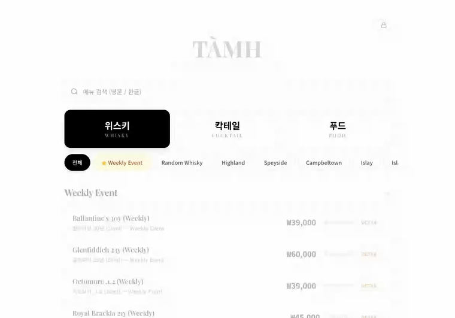
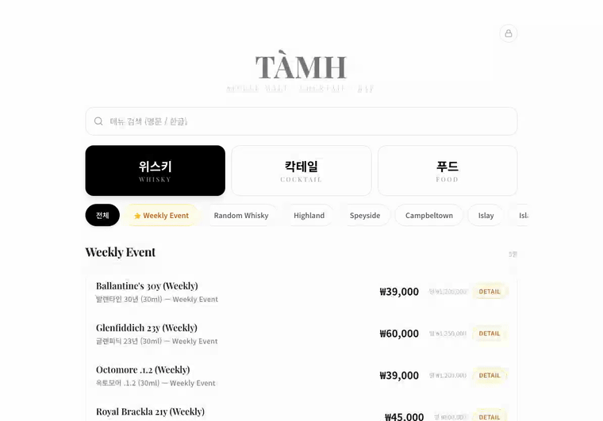
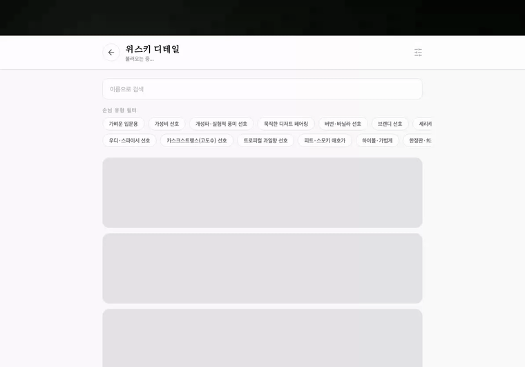

<div align="center">

<br/>

# 🥃 TÀMH — 럭셔리 바 디지털 메뉴 시스템

**손님에게는 세련된 위스키 카탈로그를, 스태프에게는 실시간 메뉴 관리를**

Single Malt · Cocktail · Bar 운영을 위한 **iPad 전용 디지털 메뉴판 웹앱**

<br/>


</div>

<br/>

## 🚀 프로젝트 개요

| 항목 | 내용 |
|------|------|
| 프로젝트 유형 | 실제 운영 바 납품용 서비스 |
| 핵심 가치 | 럭셔리 경험 · 실시간 메뉴 관리 · iPad 최적화 |
| 아키텍처 | Next.js 14 App Router + Supabase Realtime |
| 디바이스 타겟 | iPad 가로모드 (1024×768~) |
| Live URL | https://tamh-bar.vercel.app/menu |
| Repository | https://github.com/manabout-town/Tamh |

<br/>

## 🔍 해결하고자 하는 문제

기존 종이 메뉴판 운영에서 다음 문제가 반복됐습니다.

- 위스키 가격 변동 시 **메뉴판 전체 교체 비용** 발생
- 품절 발생 시 손님에게 구두로 안내해야 하는 **운영 비효율**
- 수십 종 위스키의 원산지·ABV·캐스크 정보를 **스태프가 외워야 하는 부담**

TÀMH는 이 흐름을 디지털로 전환합니다. iPad 하나로 실시간 가격 수정, 품절 처리, 위클리 이벤트 지정까지 **카운터에서 즉시 처리** 가능한 메뉴 시스템을 제공합니다.

<br/>

## 🎮 기술 스택

### ✨ Front-End / Full-Stack

<details>
<summary>⚡️ 스택 자세히 살펴보기</summary>
<br/>
<ul>
<li>Next.js : 14 (App Router, SSR + CSR 혼합)</li>
<li>TypeScript : 5</li>
<li>Tailwind CSS : 3</li>
<li>Framer Motion : 11 (페이지 전환 · 모달 · 리스트 애니메이션)</li>
<li>Lucide React (아이콘)</li>
<li>clsx + tailwind-merge (조건부 클래스)</li>
</ul>
</details>

### 🗄 Database / Backend

<details>
<summary>⚡️ DB 자세히 살펴보기</summary>
<br/>
<ul>
<li>Supabase (PostgreSQL + Row Level Security)</li>
<li>Supabase Realtime — menus · categories 실시간 동기화</li>
<li>@supabase/ssr — 서버/클라이언트 분리 클라이언트</li>
<li>Next.js API Routes — 관리자 CRUD + PIN 검증 (서비스 롤 키 격리)</li>
</ul>
</details>

### 🙌🏻 Tools

      

<br/>

## ⚙ 환경 변수

```env
NEXT_PUBLIC_SUPABASE_URL=https://xxxx.supabase.co
NEXT_PUBLIC_SUPABASE_ANON_KEY=eyJ...
SUPABASE_SERVICE_ROLE_KEY=eyJ...   # 관리자 API 전용 (서버 사이드만)
ADMIN_PIN=1234
```

<br/>

## 1️⃣ 프로젝트 구조

<details>
<summary>⚡️ 구조 자세히 살펴보기</summary>

```
src/
├── app/
│   ├── page.tsx                     # / → /menu 리다이렉트
│   ├── menu/page.tsx                # 메인 메뉴판 (SSR)
│   ├── soldout/page.tsx             # 품절 현황 보드 (SSR)
│   ├── detail/page.tsx              # 위스키 상세 탐색 (CSR)
│   └── api/admin/
│       ├── menus/route.ts           # GET 전체 / POST 생성
│       ├── menus/[id]/route.ts      # PUT 수정 / DELETE 삭제
│       └── verify/route.ts          # PIN 검증
├── components/
│   ├── layout/
│   │   ├── AmbientBackground.tsx    # 배경 분위기 레이어
│   │   ├── SiteHeader.tsx
│   │   └── SiteFooter.tsx
│   └── menu/
│       ├── MenuBoard.tsx            # 메뉴 전체 컨테이너
│       ├── CleanMenuBoard.tsx       # 클린 레이아웃 보드 (탭 · 검색 · 필터)
│       ├── CleanMenuRow.tsx         # 위스키 행 (인라인 편집 · 상세 토글)
│       ├── MenuCardGrid.tsx         # 칵테일 · 푸드 카드 그리드
│       ├── MenuFormModal.tsx        # 메뉴 추가 / 수정 모달
│       ├── PinModal.tsx             # 관리자 PIN 인증 모달
│       ├── SoldoutBoard.tsx         # 품절 현황 보드
│       └── WeeklyEventModal.tsx     # 위클리 이벤트 관리 모달
└── lib/
    ├── supabase/
    │   ├── client.ts                # 브라우저 클라이언트
    │   ├── server.ts                # 서버 클라이언트 (SSR)
    │   └── admin-client.ts          # 서비스 롤 클라이언트 (관리자 API)
    ├── use-admin-mode.ts            # PIN 인증 · 세션 훅
    ├── admin-api.ts                 # 관리자 API 호출 유틸
    ├── category-groups.ts           # 탭 · 카테고리 그룹 정의
    ├── whisky-details.ts            # 위스키 태그 · 설명 · 유사 추천 데이터
    ├── cocktail-data.ts             # 칵테일 정적 데이터
    └── food-data.ts                 # 푸드 정적 데이터
```

</details>

<br/>

## 2️⃣ 프로젝트 주제

- 실제 운영 중인 싱글 몰트 바의 **종이 메뉴 교체 비용 · 운영 비효율** 문제를 직접 해결
- iPad 하나로 손님 응대와 관리자 작업을 **동일 화면에서** 처리하는 단일 앱 설계
- **Supabase Realtime** 기반 실시간 동기화로 복수 iPad 운영 시에도 데이터 일관성 보장

<br/>

## 3️⃣ 기능 구분

#### 🍸 손님 (Guest)

- 위스키 · 칵테일 · 푸드 **3탭 메뉴판** 탐색
- **서브 카테고리 필터** (Highland / Speyside / Islay / Bourbon 등 14개 지역)
- **위클리 이벤트** 섹션 — 원가 / 행사가 동시 표시
- 영문 · 한글 **실시간 전체 검색**
- 품절 메뉴 취소선 + 뱃지 표시

#### 🥃 위스키 상세 탐색 (/detail)

- 원산지 · ABV · 캐스크 타입 상세 정보
- 태그 기반 **다중 필터** (Peaty / Sherried / Fruity / 한정판 등)
- 위스키별 **유사 추천** 리스트

#### 🔒 관리자 (Admin)

- 우상단 🔒 버튼 → **PIN 4자리** 잠금 해제 (세션 종료 시 자동 잠금)
- 잔 가격 / 병 가격 **인라인 직접 수정**
- 메뉴 **추가 · 수정 · 삭제** (모달 폼)
- `/soldout` 페이지에서 품절 **일괄 관리 · 인라인 토글**
- `is_recommended` 토글로 **위클리 이벤트** 메뉴 즉시 지정

<br/>

## 4️⃣ 데이터베이스 스키마

```sql
-- categories
id uuid PRIMARY KEY
name        text        -- "Highland", "Cocktail", "Food" 등
subtitle    text        -- 부제 (선택)
priority    int         -- 탭 내 정렬 순서
icon        text        -- 이모지 아이콘
created_at  timestamptz

-- menus
id uuid PRIMARY KEY
category_id uuid REFERENCES categories(id)
name        text                -- 영문명 (Supabase 키)
name_ko     text                -- 한글명
description text                -- 설명
price       int                 -- 잔 가격
bottle_price int                -- 병 가격
event_price  int                -- 위클리 행사가
image_url   text
origin      text                -- 원산지
abv         numeric(4,1)        -- 도수
cask_type   text                -- 캐스크 타입
is_active      bool DEFAULT true
is_recommended bool DEFAULT false   -- 위클리 이벤트 여부
created_at  timestamptz
updated_at  timestamptz
```

RLS 정책: [`supabase/rls-lock.sql`](supabase/rls-lock.sql) — 익명 사용자 읽기 허용, 쓰기는 서비스 롤 전용

<br/>

## 5️⃣ 핵심 플로우

#### 관리자 모드 진입 + 메뉴 수정 흐름

```
🔒 잠금 버튼 클릭
    → PIN 4자리 입력
    → /api/admin/verify (서버 사이드 PIN 비교)
    → 세션 활성화 (탭 단위, 새로고침 유지)
        → 인라인 가격 편집 활성화
        → 메뉴 CRUD 모달 활성화
        → 품절 토글 활성화
        → 위클리 이벤트 토글 활성화
    → 세션 종료 시 자동 잠금
```

#### Realtime 동기화 흐름

```
관리자 iPad (가격 수정)
    → PUT /api/admin/menus/:id
    → Supabase UPDATE
    → Realtime 채널 broadcast
        → 손님 iPad 즉시 반영
        → 다른 스태프 iPad 즉시 반영
```

<br/>

## 6️⃣ 주요 기능 (핵심 시연)

> 아래 GIF는 실제 iPad 운영 화면입니다.

<table>
<tr>
  <td align="center"><b>메뉴판 + 탭 전환</b></td>
  <td align="center"><b>위클리 이벤트 섹션</b></td>
</tr>
<tr>
  <td></td>
  <td></td>
</tr>
<tr>
  <td align="center"><b>관리자 PIN + 인라인 가격 편집</b></td>
  <td align="center"><b>품절 관리</b></td>
</tr>
<tr>
  <td></td>
  <td></td>
</tr>
</table>

<br/>

## 7️⃣ 기능 — 메뉴판 (/menu)

<table>
<tr>
  <td align="center"><b>전체 검색</b></td>
  <td align="center"><b>카테고리 필터</b></td>
  <td align="center"><b>메뉴 추가 모달</b></td>
</tr>
<tr>
  <td></td>
  <td></td>
  <td></td>
</tr>
</table>

<br/>

## 8️⃣ 기능 — 위스키 상세 탐색 (/detail)

<table>
<tr>
  <td align="center"><b>태그 다중 필터</b></td>
  <td align="center"><b>위스키 상세 + 유사 추천</b></td>
</tr>
<tr>
  <td></td>
  <td></td>
</tr>
</table>

<br/>

## 🧩 기술적 하이라이트

### 1. 서비스 롤 키 격리 — 관리자 API 보안

브라우저 클라이언트가 직접 Supabase `SERVICE_ROLE` 키를 갖지 않도록 모든 관리자 쓰기 작업을 Next.js API Route를 통해 처리합니다. PIN 검증은 서버에서만 수행하고, 성공 후에야 서비스 롤 클라이언트를 통해 DB에 접근합니다.

```ts
// lib/supabase/admin-client.ts
import { createClient } from "@supabase/supabase-js";

export function createAdminClient() {
  return createClient(
    process.env.NEXT_PUBLIC_SUPABASE_URL!,
    process.env.SUPABASE_SERVICE_ROLE_KEY!  // 서버 사이드 전용
  );
}
```

### 2. 인라인 가격 편집 — 낙관적 업데이트 없이 즉각 반영

`CleanMenuRow`는 편집 완료(blur/Enter) 시 즉시 API 호출 후 Supabase Realtime이 전체 클라이언트에 변경을 브로드캐스트하는 방식으로, 별도 전역 상태 없이 다중 iPad 동기화를 달성합니다.

### 3. iPad 가로모드 단일 화면 설계

스크롤 없이 한 화면에 메뉴를 표시하는 것을 원칙으로, 위스키 목록은 고정 높이 컨테이너 내부 스크롤로 처리합니다. 터치 타겟 최소 44px, 폰트·여백 모두 1024×768 기준으로 설계되어 카운터 현장에서 실수 없이 빠르게 조작 가능합니다.

<br/>

## 🚀 빠른 시작

```bash
git clone https://github.com/manabout-town/Tamh.git
cd Tamh
npm install
cp .env.example .env.local
# .env.local 환경변수 입력
npm run dev
# → http://localhost:3000/menu
```

### Supabase 셋업

Supabase SQL Editor에서 순서대로 실행:

```
supabase/data.sql      — 테이블 생성 + 전체 메뉴 시드
supabase/rls-lock.sql  — RLS 정책 적용
```

Database → Replication → `menus`, `categories` Realtime 활성화.

<br/>

## 📦 주요 의존성

```json
{
  "next": "14.2.18",
  "react": "^18.3.1",
  "framer-motion": "^11.11.17",
  "@supabase/supabase-js": "^2.45.4",
  "@supabase/ssr": "^0.5.2",
  "tailwindcss": "^3.4.14",
  "lucide-react": "^0.456.0",
  "clsx": "^2.1.1",
  "tailwind-merge": "^2.5.4"
}
```

<br/>

---

<div align="center">

Made with 🥃 for **TÀMH**

</div>
